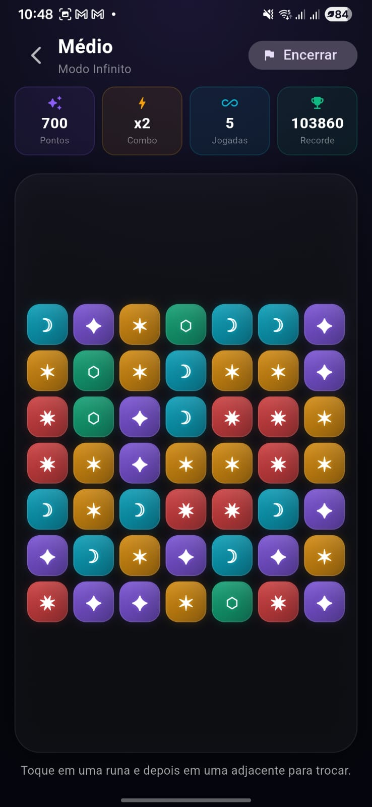

# Runebound

Runebound e um jogo mobile e desktop de combinar runas (match-3) feito em Flutter, com visual mistico, animacoes de particulas e progressao por fases.

## Demonstração

<p align="center">
	
	
</p>

## Sobre o jogo

Em Runebound, o jogador combina simbolos arcanos em um tabuleiro para acumular pontos, criar combos em cadeia e cumprir objetivos.

O projeto inclui:

- Modo campanha com fases progressivas.
- Modo infinito com niveis de dificuldade.
- Sistema de recordes persistidos localmente.
- Animacoes de swap, queda e explosao de runas.
- Interface com identidade visual fantasy/sci-fi.

## Principais mecanicas

- Match de 3 ou mais runas na horizontal e vertical.
- Pontuacao com multiplicadores:
- Match de 3: pontuacao base.
- Match de 4: multiplicador x2.
- Match de 5+: multiplicador x3.
- Combos em cascata aumentam o ganho total.
- Campanha com limite de movimentos e pontuacao alvo.
- Infinito sem limite de movimentos para buscar maior score.

## Modos de jogo

### Campanha

5 fases com aumento de dificuldade por tamanho do tabuleiro, quantidade de simbolos e meta de pontuacao.

- Planicie das Runas.
- Floresta do Crepusculo.
- Citadela de Cristal.
- Abismo das Estrelas.
- Trono do Eterno.

### Infinito

3 niveis de dificuldade:

- Facil: 6x6, 4 tipos de runas.
- Medio: 7x7, 5 tipos de runas.
- Dificil: 8x8, 6 tipos de runas.

## Tecnologias

- Flutter (Material 3).
- Dart SDK 3.10.7+.
- shared_preferences (persistencia local de recordes).
- flutter_animate (efeitos visuais e transicoes).

## Requisitos

- Flutter SDK instalado e configurado no PATH.
- Dart SDK compativel com o Flutter da maquina.
- Android Studio e/ou Xcode (para builds mobile).

Verifique com:

```bash
flutter --version
flutter doctor
```

## Como rodar o projeto

### 1. Clonar o repositorio

```bash
git clone https://github.com/vinicius-pascoal/Runebound.git
cd Runebound
```

### 2. Instalar dependencias

```bash
flutter pub get
```

### 3. Executar

Escolha um dispositivo/simulador disponivel:

```bash
flutter devices
flutter run
```

Para web:

```bash
flutter run -d chrome
```

Para desktop (exemplo Windows):

```bash
flutter config --enable-windows-desktop
flutter run -d windows
```

## Build de release

Android APK:

```bash
flutter build apk --release
```

Android App Bundle:

```bash
flutter build appbundle --release
```

Web:

```bash
flutter build web --release
```

Windows:

```bash
flutter build windows --release
```

## Estrutura do projeto

```text
lib/
	main.dart
	game/
		phase_model.dart
		particle_burst.dart
		score_service.dart
	screens/
		home_screen.dart
		game_screen.dart
assets/
	icons/
	sounds/
```

## Persistencia de dados

Os melhores scores ficam salvos localmente com shared_preferences.

Chaves utilizadas:

- best_score_phase_<id>
- best_score_infinite_<id>

## Futuras melhorias

- Efeitos sonoros e trilha dinamica.
- Novos tipos de runas especiais.
- Poderes e habilidades por fase.
- Sistema de conquistas.

## Contribuicao

Contribuicoes sao bem-vindas.

Fluxo recomendado:

1. Crie uma branch para sua feature/fix.
2. Implemente e valide com testes locais.
3. Abra um Pull Request descrevendo as alteracoes.
